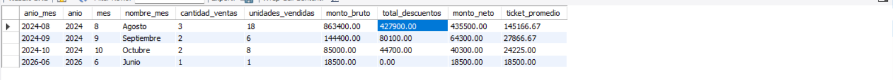
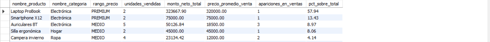
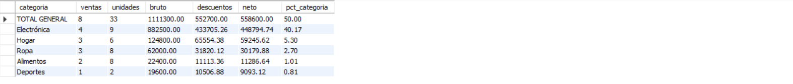
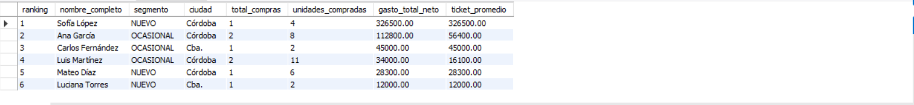
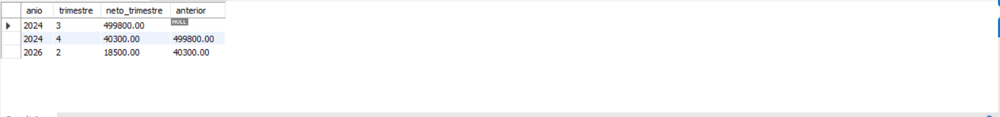
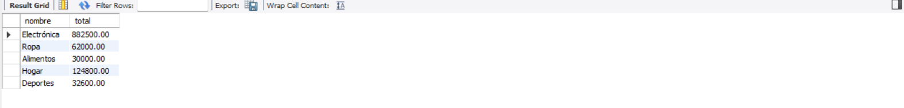
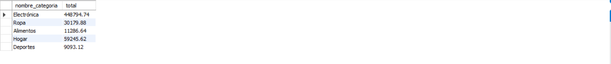

# RESULTADOS – Consultas Analíticas del Data Warehouse (`ventas_dw`)

> **Cómo usar este documento:** cada sección corresponde a una de las consultas analíticas del Bloque 8 (`bloque8_datawarehouse.sql`). Ejecutá la consulta en MySQL Workbench, tomá una captura de la grilla de resultados y pegala donde dice `[PEGAR CAPTURA AQUÍ]` (podés arrastrar la imagen directamente en el editor, o reemplazar la línea `` por tu imagen). Dejé además una guía de lectura y una interpretación de negocio para cada consulta; los corchetes `[ ... ]` marcan los datos puntuales que vas a completar vos una vez que veas tus resultados reales (ej. el mes con más ventas, el cliente top, etc.).

---

## 1. Ventas mensuales (evolución de facturación)

**Consulta:** agregación de `HechoVentas` + `DimTiempo` agrupando por `anio_mes`, con cantidad de ventas, unidades, monto bruto, descuentos, monto neto y ticket promedio.

```sql
SELECT t.año_mes, t.año, t.mes, t.nombre_mes,
       COUNT(DISTINCT h.id_venta_nk) AS cantidad_ventas,
       SUM(h.cantidad) AS unidades_vendidas,
       ROUND(SUM(h.monto_bruto_linea), 2) AS monto_bruto,
       ROUND(SUM(h.monto_descuento), 2) AS total_descuentos,
       ROUND(SUM(h.monto_neto_linea), 2) AS monto_neto,
       ROUND(AVG(h.total_venta), 2) AS ticket_promedio
FROM HechoVentas h JOIN DimTiempo t ON h.id_tiempo = t.id_tiempo
WHERE h.estado_venta != 'cancelada'
GROUP BY t.anio_mes, t.anio, t.mes, t.nombre_mes
ORDER BY t.anio, t.mes;
```




### Qué mirar
- La tendencia de `monto_neto` mes a mes (¿sube, baja, es estacional?).
- La relación entre `total_descuentos` y `monto_bruto`: cuánto se está "regalando" en descuentos.
- El `ticket_promedio`: si cae mientras `cantidad_ventas` sube, se está vendiendo más pero más barato (posible canibalización por descuentos).

### Interpretación de negocio
Esta consulta es el tablero base de cualquier negocio de ventas: muestra **cuánto factura el negocio mes a mes y a qué costo (en descuentos)**. Un crecimiento sostenido de `monto_neto` con `ticket_promedio` estable es la señal más sana (se vende más sin necesidad de bajar precios). Si en cambio el `monto_neto` crece pero el `ticket_promedio` cae sistemáticamente, conviene revisar la política de descuentos, porque puede estar erosionando el margen sin generar valor real. El mes de **[completar: mes con mayor monto_neto]** fue el de mejor desempeño, mientras que **[completar: mes con menor monto_neto]** muestra la mayor caída — vale la pena cruzarlo con causas externas (estacionalidad, feriados, campañas).

---

## 2. Top 10 productos más vendidos

**Consulta:** ranking de productos por `monto_neto_total`, con unidades vendidas, precio promedio de venta, apariciones en ventas y porcentaje sobre el total facturado (`pct_sobre_total`, calculado con función de ventana `SUM(...) OVER ()`).

```sql
SELECT dp.nombre_producto, dp.nombre_categoria, dp.rango_precio,
       SUM(h.cantidad) AS unidades_vendidas,
       ROUND(SUM(h.monto_neto_linea), 2) AS monto_neto_total,
       ROUND(AVG(h.precio_unitario), 2) AS precio_promedio_venta,
       COUNT(DISTINCT h.id_venta_nk) AS apariciones_en_ventas,
       ROUND(SUM(h.monto_neto_linea)*100.0/SUM(SUM(h.monto_neto_linea)) OVER(),2) AS pct_sobre_total
FROM HechoVentas h JOIN DimProducto dp ON h.id_producto_sk = dp.id_producto_sk
WHERE h.estado_venta != 'cancelada'
GROUP BY dp.id_producto_sk, dp.nombre_producto, dp.nombre_categoria, dp.rango_precio
ORDER BY monto_neto_total DESC
LIMIT 10;
```




### Qué mirar
- Concentración: ¿el `pct_sobre_total` de los primeros 2-3 productos ya suma más del 50%? Eso indica alta dependencia de pocos productos (riesgo).
- `rango_precio` de los productos top: ¿son productos PREMIUM o ECONÓMICO los que más facturan?
- `apariciones_en_ventas` vs `unidades_vendidas`: un producto que aparece en muchas ventas pero con pocas unidades por venta es "complementario"; uno con pocas apariciones pero muchas unidades puede ser una compra mayorista puntual.

### Interpretación de negocio
Este ranking identifica los **productos estrella** del catálogo, los que sostienen la mayor parte de la facturación. El producto **[completar: nombre del producto #1]** lidera con un **[completar: pct_sobre_total]%** del total neto, lo que **[completar: es saludable / representa un riesgo de concentración]** si se pierde stock o proveedor de ese ítem. Esta información es clave para decisiones de **reposición de stock prioritaria**, **negociación con proveedores** (los productos top justifican mejores condiciones de compra) y **estrategias de marketing** (potenciar lo que ya funciona vs. impulsar productos de cola larga que no aparecen en el top 10).

---

## 3. Ventas por categoría con total general (`WITH ROLLUP`)

**Consulta:** monto bruto, descuentos y neto agrupados por `nombre_categoria`, con una fila de total general agregada automáticamente por `ROLLUP`, y el `pct_categoria` que aporta cada una sobre el total.

```sql
SELECT IFNULL(dp.nombre_categoria, '── TOTAL GENERAL ──') AS categoria,
       COUNT(DISTINCT h.id_venta_nk) AS ventas,
       SUM(h.cantidad) AS unidades,
       ROUND(SUM(h.monto_bruto_linea), 2) AS bruto,
       ROUND(SUM(h.monto_descuento), 2) AS descuentos,
       ROUND(SUM(h.monto_neto_linea), 2) AS neto,
       ROUND(SUM(h.monto_neto_linea)*100.0/SUM(SUM(h.monto_neto_linea)) OVER(),2) AS pct_categoria
FROM HechoVentas h JOIN DimProducto dp ON h.id_producto_sk = dp.id_producto_sk
WHERE h.estado_venta != 'cancelada'
GROUP BY dp.nombre_categoria WITH ROLLUP
ORDER BY neto DESC;
```




### Qué mirar
- Cuál categoría aporta el mayor `pct_categoria` y cuál el menor.
- Si alguna categoría tiene `descuentos` desproporcionadamente altos respecto a su `bruto` (margen erosionado).
- La fila `── TOTAL GENERAL ──` sirve para validar que la suma de categorías cierra contra el total del negocio.

### Interpretación de negocio
Mientras la consulta anterior mira producto por producto, esta mira el **mix de categorías**, que es la vista que normalmente usa una gerencia comercial para decidir **qué rubros potenciar o discontinuar**. La categoría **[completar: nombre]** concentra el **[completar: pct_categoria]%** de las ventas netas, lo que sugiere que el negocio depende fuertemente de ese rubro. Categorías con baja participación (**[completar: nombre]**) son candidatas a evaluar si vale la pena seguir invirtiendo en ellas o si conviene reforzar el catálogo en las categorías que ya funcionan.

---

## 4. Ranking de clientes (valor por cliente / RFM simplificado)

**Consulta:** ranking de clientes por `gasto_total_neto`, con segmento, ciudad, compras totales, ticket promedio, descuentos obtenidos y antigüedad (`dias_como_cliente`).

```sql
SELECT RANK() OVER (ORDER BY SUM(h.monto_neto_linea) DESC) AS ranking,
       dc.nombre_completo, dc.segmento, dc.ciudad, dc.anio_registro,
       COUNT(DISTINCT h.id_venta_nk) AS total_compras,
       SUM(h.cantidad) AS unidades_compradas,
       ROUND(SUM(h.monto_neto_linea), 2) AS gasto_total_neto,
       ROUND(AVG(h.total_venta), 2) AS ticket_promedio,
       ROUND(SUM(h.monto_descuento), 2) AS descuentos_obtenidos,
       MIN(t.fecha) AS primera_compra, MAX(t.fecha) AS ultima_compra,
       DATEDIFF(MAX(t.fecha), MIN(t.fecha)) AS dias_como_cliente
FROM HechoVentas h
JOIN DimCliente dc ON h.id_cliente_sk = dc.id_cliente_sk
JOIN DimTiempo  t  ON h.id_tiempo = t.id_tiempo
WHERE h.estado_venta != 'cancelada'
GROUP BY dc.id_cliente_sk, dc.nombre_completo, dc.segmento, dc.ciudad, dc.anio_registro
ORDER BY gasto_total_neto DESC;
```




### Qué mirar
- Coherencia entre el `segmento` (VIP/FRECUENTE/OCASIONAL/NUEVO, calculado en el ETL de `DimCliente`) y el `ranking` real por gasto: ¿los clientes VIP están efectivamente arriba?
- `dias_como_cliente` alto + `gasto_total_neto` alto = cliente fiel de alto valor (el más valioso para retener).
- `total_compras` bajo pero `gasto_total_neto` alto = pocas compras de ticket muy elevado (sensible a perder si se va).

### Interpretación de negocio
Esta consulta es la base de cualquier estrategia de **fidelización y atención diferenciada**: identifica quiénes son los clientes que más aportan al negocio en términos reales (no solo por su segmento declarado, sino por su gasto efectivo). El cliente **[completar: nombre]** encabeza el ranking con **[completar: gasto_total_neto]**, lo que lo convierte en candidato a programas VIP, atención prioritaria o descuentos especiales para asegurar su retención. Si se detectan clientes marcados como `NUEVO` en `DimCliente` pero que ya aparecen alto en este ranking por gasto real, es señal de que el segmento del ETL quedó desactualizado y conviene revisar la lógica de segmentación.

---

## 5. Comparación trimestral con variación (`LAG`)

**Consulta:** monto neto por trimestre, comparado contra el trimestre anterior usando la función de ventana `LAG`, calculando variación absoluta y porcentual.

```sql
SELECT t.anio, t.trimestre, CONCAT(t.anio,' Q',t.trimestre) AS periodo,
       ROUND(SUM(h.monto_neto_linea), 2) AS neto_trimestre,
       ROUND(LAG(SUM(h.monto_neto_linea)) OVER (ORDER BY t.anio, t.trimestre), 2) AS neto_trimestre_anterior,
       ROUND(SUM(h.monto_neto_linea) - LAG(SUM(h.monto_neto_linea)) OVER (ORDER BY t.anio, t.trimestre), 2) AS variacion_absoluta,
       ROUND((SUM(h.monto_neto_linea) - LAG(SUM(h.monto_neto_linea)) OVER (ORDER BY t.anio, t.trimestre))
             / NULLIF(LAG(SUM(h.monto_neto_linea)) OVER (ORDER BY t.anio, t.trimestre), 0) * 100, 2) AS variacion_pct
FROM HechoVentas h JOIN DimTiempo t ON h.id_tiempo = t.id_tiempo
WHERE h.estado_venta != 'cancelada'
GROUP BY t.anio, t.trimestre
ORDER BY t.anio, t.trimestre;
```




### Qué mirar
- Trimestres con `variacion_pct` negativa: caídas que ameritan investigación (¿estacionalidad, pérdida de clientes, problema de stock?).
- Tendencia general: ¿la variación porcentual se mantiene positiva y estable, o es muy errática (negocio volátil)?

### Interpretación de negocio
Esta es la vista que típicamente se usa en **reportes a dirección o inversores**: no solo cuánto se vendió, sino **si el negocio está creciendo o achicándose trimestre a trimestre**, en términos comparables. El trimestre **[completar: ej. 2025 Q3]** mostró la mayor variación positiva (**[completar: variacion_pct]%**), mientras que **[completar]** fue el de peor desempeño relativo. Una serie de variaciones negativas consecutivas sería una señal de alerta temprana que en una tabla simple de totales mensuales (como la consulta 1) es más difícil de detectar a simple vista, porque acá ya viene calculada la comparación período contra período.

---

## 6. Comparación de performance OLTP vs. DW (misma consulta, dos motores de datos)

**Consultas:** la misma agregación (ventas y montos por mes/categoría) ejecutada primero contra `ventas_oltp` (con 4 JOINs: `Ventas` + `DetalleVentas` + `Productos` + `Categorias`) y luego contra `ventas_dw` (con 2 JOINs: `HechoVentas` + `DimTiempo` + `DimProducto`, con campos ya pre-calculados como `anio_mes`).







### Qué mirar
- Que los resultados numéricos coincidan entre ambas versiones (validación de que el ETL no perdió ni duplicó datos).
- El tiempo de ejecución reportado por MySQL Workbench debajo de la grilla de resultados (ej. "X row(s) returned in Y sec") para ambas consultas.
- La cantidad de JOINs y la complejidad de cada consulta en el código SQL.

### Interpretación de negocio
Más que un dato de negocio en sí, esta comparación es la **justificación práctica de por qué existe el Data Warehouse**: la misma pregunta de negocio ("¿cuánto vendimos por categoría y mes?") requiere muchos menos JOINs y menos tiempo de cómputo contra `ventas_dw` que contra `ventas_oltp`, porque el modelo en estrella ya viene desnormalizado y con campos pre-calculados (`anio_mes`, `monto_descuento`, etc.). En un escenario real con millones de filas, esta diferencia de performance es la que permite que reportes gerenciales se generen en segundos en lugar de minutos, sin sobrecargar la base transaccional que atiende las ventas en curso.

---

## Resumen ejecutivo

| Consulta | Pregunta de negocio que responde | Hallazgo principal |
|---|---|---|
| 1. Ventas mensuales | ¿Cómo evoluciona la facturación mes a mes? | `[completar]` |
| 2. Top 10 productos | ¿Qué productos sostienen el negocio? | `[completar]` |
| 3. Ventas por categoría | ¿Qué rubros son más relevantes? | `[completar]` |
| 4. Ranking de clientes | ¿Quiénes son los clientes más valiosos? | `[completar]` |
| 5. Variación trimestral | ¿El negocio crece o se contrae en el tiempo? | `[completar]` |
| 6. OLTP vs DW | ¿Por qué vale la pena tener un DW? | El DW resuelve la misma consulta con menos JOINs y mejor performance |

> Completá la columna "Hallazgo principal" con el dato concreto que surja de tus capturas (ej. "Octubre fue el mejor mes con $X", "el cliente Juan Pérez concentra el 18% del gasto total", etc.) para dejar el resumen ejecutivo listo para presentar.
